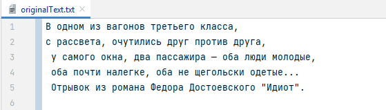
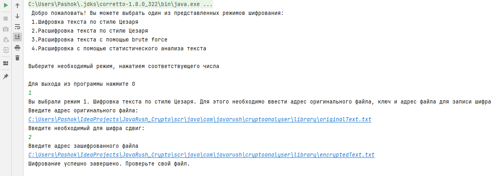
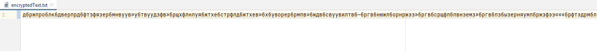
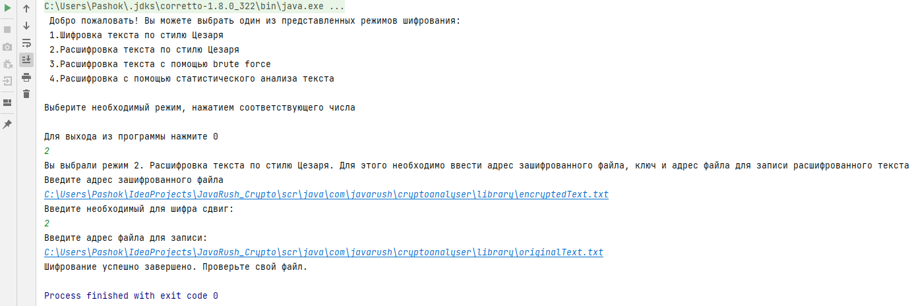
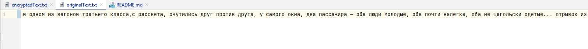
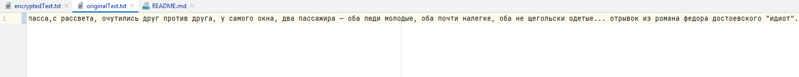
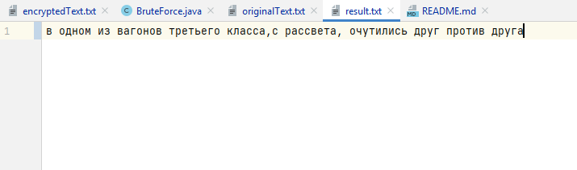
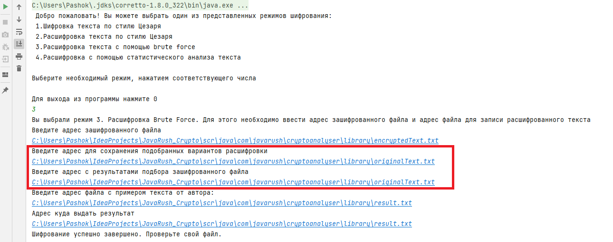
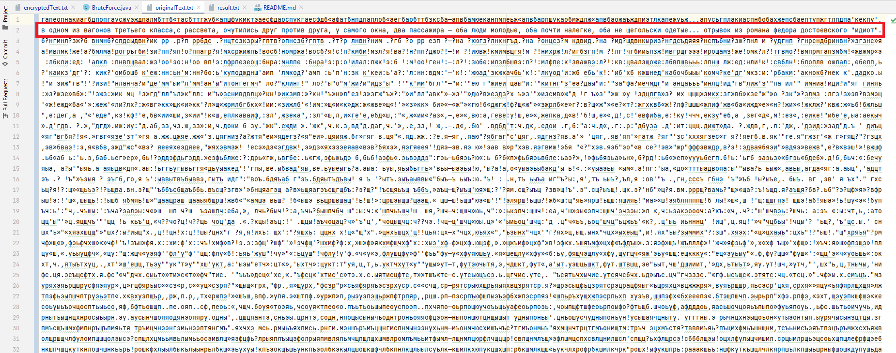
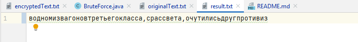

# JavaRush Project "Криптоанализатор".

---
**Описание:** программа, которая работает с шифром Цезаря.

Шифр Цезаря — это шифр подстановки: в нем каждый символ в открытом тексте заменяется на символ,
который находится на некотором постоянном числе позиций левее или правее него в алфавите.

Допустим, мы устанавливаем сдвиг на 3 (ключ = 3).
В таком случае А заменится на Г, Б станет Д, и так далее.

Всего программа содержит 3 рабочих режима: 

* Шифровка
* Расшифровка
* Взлом (Brute Force)

---
## Описание классов

---
* В пакете `for_the_user` содержится класс `ForTheUser` - класс в котором
реализующий диалог с пользователем
* В пакете `file_option` содержится класс `FileOption` - класс реализует
основные операции по запросу адреса файла, чтению и записи файла.
* В пакете `caesar_encryption` содержится класс `CaesarEncryption` - класс, который 
шифрует файл по стилю Цезаря (Рабочий режим №1).
* В пакете `decryption_by_caesar_method` содержится класс `DecryptionByCaesarMethod` -
класс, расшифровывает файл по стилю Цезаря (Рабочий режим №2.)
* В пакете `brute_force` содержится два класса (Рабочий режим №3):
   * класс `BruteForce` - класс, реализующий перебор всех возможных вариантов ключа
    * класс `KeyVerification` - класс, реализующий поиск правильного варианта и 
    вывода расшифрованных слов и всех совпадений.
  
* В пакете `library` размещено три файла:
   - `encryptedText.txt` - файл для хранения и записи в него зашифрованного текста
    - `originaltext.txt` - файл с оригинальным текстом
    - `result.txt` - файл для вывода результата в режиме bruteForce

---
##Пример реализации 

---
### 1. Режим шифровки:
Оригинальный текст:

Введенные данные:

Зашифрованный текст:

### 2. Режим дешифровки:

Зашифрованный текст:

Введенные данные:

Вывод расшифрованного файла:

### 3. Режим Brute Force:
Зашифрованный файл:

Файл с примерным текстом:

Введенные данные:

**Программа пишет в файл все возможные варианты, для этого необходимо указать дополнительный адрес с файлом и после прочитать 
все варианты из него.**

Вывод всех вариантов в файл:

Файл с результатом:

